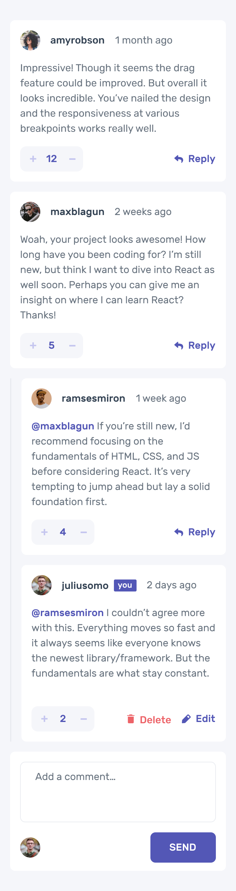

# Interactive Comments Section

This project is an interactive comments section built with React Native and Expo. It aims to provide a dynamic user experience for posting and interacting with comments on a mobile application.

## Features

- Light and dark mode support using `useColorScheme` hook.
- Cross-platform compatibility (iOS, Android, Web).
- Utilizes `nativewind` for styling to support server rendering.
- Reset project script for easy project initialization.

## Installation

To get started with the project, follow these steps:

1. Clone the repository.
2. Install dependencies with `npm install`.
3. Start the project with `npm start`.

For specific platform builds, you can use:

- `npm run android` for Android.
- `npm run ios` for iOS.
- `npm run web` for Web.

## Testing

Run tests using the following command:

```sh
npm run test
```
